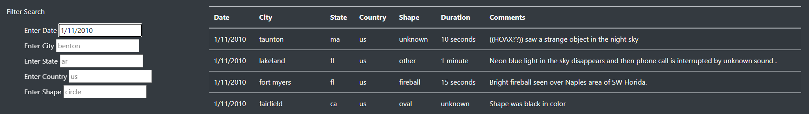
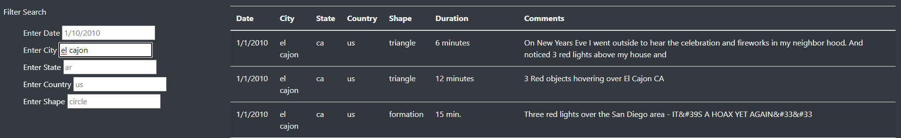
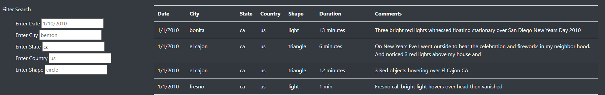
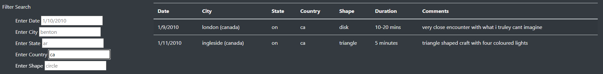
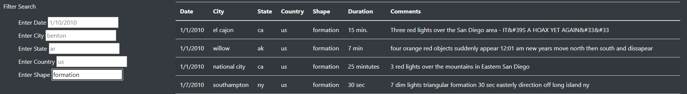
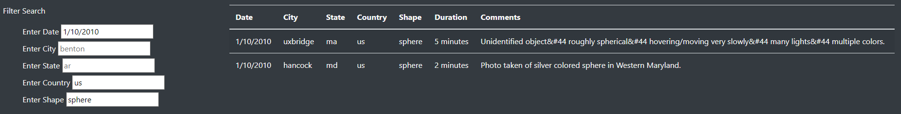

# UFOs

### Overview 
Dana is a Data Journalist exploring the topic of her choosing. She has the opportunity to write about her hometown and the topic her hometown is known for, UFO sightings. Dana has created a website using HTML and JavaScript to showcase data on UFO findings throughout the world. She has also created filters on the website to enable the user to find specific data in the dataset.

### Results
There is quite a lot of data to be found on the website, and as a new user this data might feel overwhelming. By using the Filter Search Menu located in the bottom left of the page, the user can search for specific keywords to find data of interest, such as: 

##### Searching by sighting Date 

##### Searching by City 

##### Searching by State 

##### Searching by Country 

##### Searching by Shape

This way the user can find exactly the data they are looking for without scrolling endlessly through the whole data set. The user can also search for data using multiple filters, as seen here:

### Summary

##### Drawbacks and Recommendations
With a great tool such as the filter search, one drawback of this design is that the keyword in the filter has to match the keyword in the data exactly, thus it is near impossible for the user to know his data options without narrowing down his search in steps. One recommendation is to further develop the search to filter per keypress using regex expressions, to find any matching data, instead of having a dependency on the user matching full words before viewing the search results. In addition, it would be a good idea to add clear indications of what filters are currently in use, as currently, the filter text nearly matches the placeholder text.
